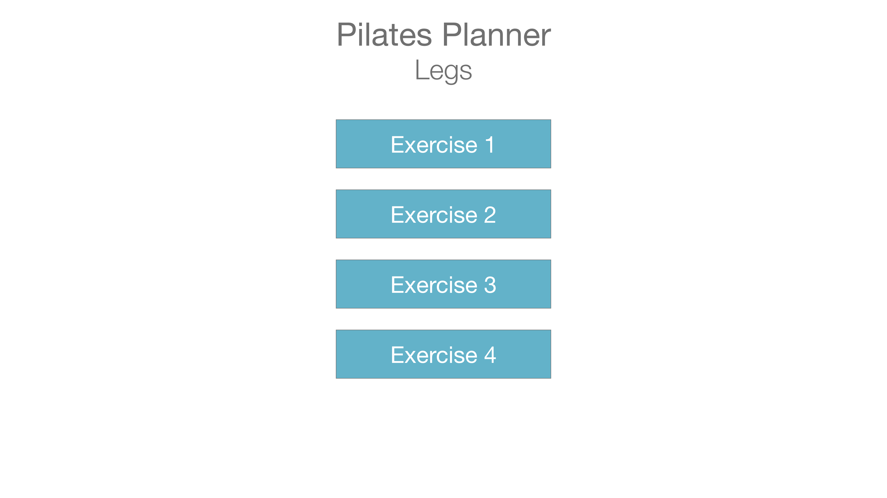

**PROJECT DESCRIPTION**

Pilates Planner is a full stack web application for creating and organizing lesson plans for pilates classes.

**Below is a link to the app itself**

https://fathomless-fortress-30903.herokuapp.com/

**Below is a link to the Trello Board**

https://trello.com/b/rJWyZYuF/pilates-planner

**Below is a link to the wireframe images**

**Below is a list of technologies/libraries/frameworks/dependencies and resources... think of this section as a citation of sources**

Adobe XD, Adobe Photoshop, MondoDB, Mongoose, Express.js, React.js, Node.js, styled-components, axios, react-router-dom, npm, nodemon, Heroku, Github. 

**Below is a list of goals for version 2**

- version 2 goal: 
- version 2 goal: 
- version 2 goal: 

**Special Thanks**

- 
- 

for inspiration, motivation, and guidance along the way!