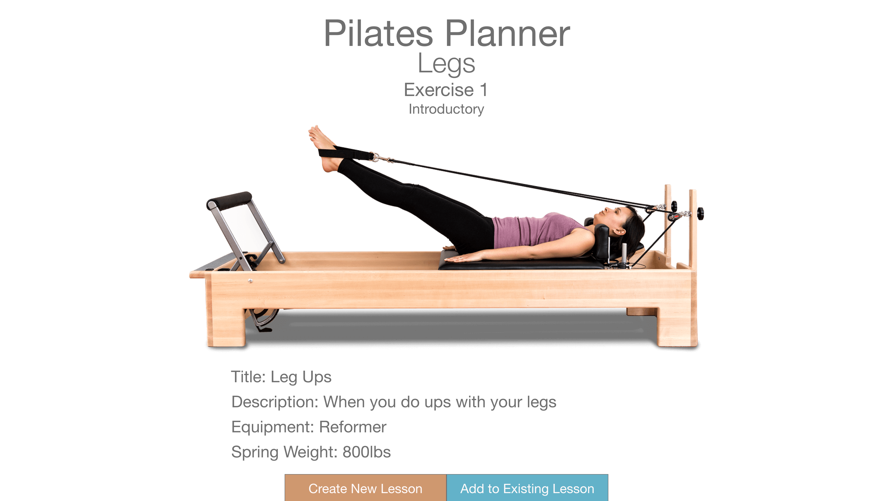

#PROJECT DESCRIPTION#

Pilates Planner is a full stack web application for creating and organizing lesson plans for pilates classes! With this app a pilates instructor can easily create new Lessons based on difficulty level and muscle groups and add Exercises to those lesson plans. Version 2 will integrate with the Google Calendar API so that Lessons can be assigned a specific date and time!

**Below is a link to the app itself**

https://fathomless-fortress-30903.herokuapp.com/

**Below is a link to the Trello Board**

https://trello.com/b/rJWyZYuF/pilates-planner

**Below is a link to the wireframe images**

**Below is a list of technologies/libraries/frameworks/dependencies and resources... think of this section as a citation of sources**

Adobe XD, Adobe Photoshop, Adobe Capture, MondoDB, Mongoose, Express.js, React.js, Node.js, styled-components, Materialize, axios, react-router-dom, npm, nodemon, Heroku, Github, react-google-calendar-api, W3Schools, and classroom lessons.

**Below is a list of goals for version 2**

- version 2 goal: Add AuthO sign in functionality.
- version 2 goal: The lessons will be able to be added to a Google Calendar using their API.
- version 2 goal: There will be a sharing feature and a student log in portal.

**Special Thanks**

- Ranna Nix
- JB Watson
- William Njie
- Daniel Mishael
- Andrew McIntosh
- Mark Haley
- C'zar Dubois
- James Royals
- Spencer Merryman
- Cameron Gunter
- Stanley Kimani
- Noah Harvey

for inspiration, motivation, and guidance along the way!